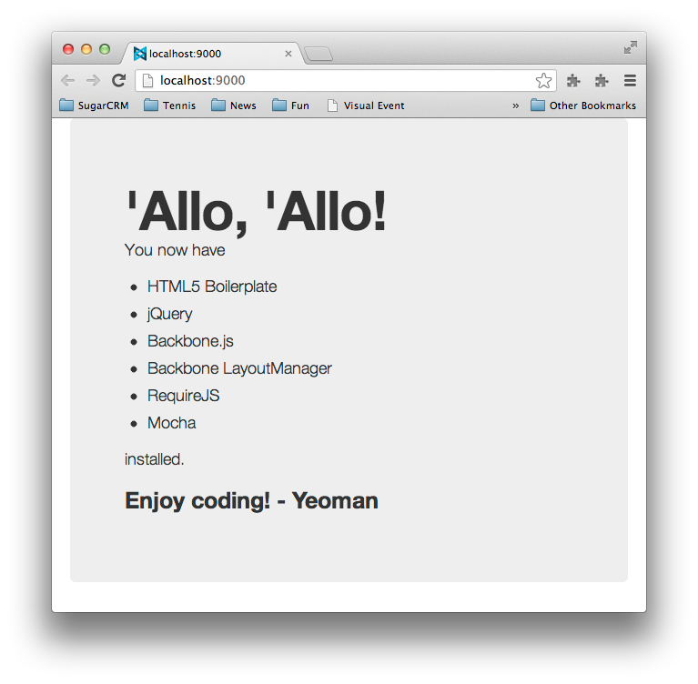

<a id="setting_up"></a>

# Setting up

In this chapter we'll briefly introduce CSS preprocessors ([Compass][compass], [Sass][sass], [LESS][less], etc.), [Twitter Bootstrap][bootstrap], and end with a look at the workflow power-tool [Yeoman][yeoman]. We'll answer these questions:

* What is a CSS preprocessor and why should I use one?
* What are Compass and Sass?
* What is Twitter Bootstrap and how can I benefit from it?
* What is Yeoman, and how can I use it to improve my workflow?

Let's discuss some of the core tools we'll be using throughout the remainder of this book...

### What is a CSS preprocessor?

A CSS preprocessor is simply a tool that takes text you've written in the preprocessor's language (usually a super-set of CSS), and converts it into valid CSS. Because the preprocessor language is, essentially a super-set of CSS, it adds useful mechanisms such as variables, nesting, mixins, basic math, etc.

Just taking the variable feature, for example, you might define a color variable in one place and then reference it later as needed:

```css
$dark: #333;
...
.foo { background-color: $dark }
.bar { background-color: $dark }
.baz { background-color: $dark }
```

Later, if you decide you'd like $dark to be, well, a bit darker, you could simply redefine the initial declaration like so:

```css
$dark: #191919;
```

Now, `.foo`, `.bar`, and `.baz` will all be updated to use the new background-color the next time your .scss file is converted to CSS.

I'd be remiss not to mention that the three most popular CSS preprocessors today are LESS, Sass, and Stylus. All have their [merits][lessvssassvsstylus] but we'll primarily be using Sass in this book.

### Why use a CSS preprocessor?

If you've done much web development, you're already aware that CSS can get unruly fast! Using a preprocessor affords a nice means of keeping CSS organized and maintainable. This point is best proven by example—so let's move on to discussing Sass.

### What is Sass?

Sass is an open source tool that allows its metalanguage—also called Sass—to be interpreted into CSS. It has two syntaxes, `.sass` and `.scss`. We'll only be covering the `.scss` syntax which is a super set of CSS that provides conveniences such as: variables, nesting, mixins, selector inheritance, and much more. [[1]][sass-wikip] In a bit, we'll examine exactly what those mechanisms are and how they work. But for now, let's take a look at Sass's complimentary technology Compass. [[2]][sassbook]

### What is Compass?

Compass is a combination of things. It's a workflow tool for Sass that sets up relative paths (such as the relative path to your images via the image_url property; it does this via a config.rb configuration file). It then "watches" changes you make in your .scss files compiling those in to valid CSS. Compass also provides is a vast library of reusable Sass mixins for grids, tables, lists, CSS3, and more. Lastly, Compass is a full scope platform for building frameworks and extensions. [[3]][eppstein-compass]

Again, we'll be going over how to use Compass in more detail soon, but first let's have a quick look at Twitter Bootstrap...

### Twitter Bootstrap: Not just a CSS framework!

[Twitter Bootstrap][bootstrap] is an open source framework that contains a set of CSS boiler plate templates for typography, buttons, charts, forms, tables, navigation and layout, etc. This CSS depends on a small set of HTML class name conventions such that any web author can "hook into" these styles by simply providing the proper markup. It also features a 12-column responsive grid so your site can adapt to different devices. It's currently the most popular GitHub project and used by big hitters such as NASA and MSNBC. [[4]][bootstrap-big-hitters]

In addition to interface components, the Bootstrap framework provides a plethora of JavaScript plugins that support dynamic UI components such as Modal, Tab, Tooltip, Popover, Alert, Carousel, Typeahead, Dropdown, and more. It's only real dependency is [jQuery][jquery].

## Setting Up For Development

In this section we will be setting the stage for things to come by installing Compass/Sass, Twitter Bootstrap and any other dependencies along the way. We'll first show how you to set up some of the tools individually, and then show how you can do it all at once with [Yeoman][yeoman]. If you're already sure you want to use [Yeoman][yeoman] feel free to skip to that section (but first ensure you have [Git][git] and [Ruby][ruby] installed).

_Since hard-disk space is so cheap these days, we feel it's worth creating a `labs` directory for experimentation, so you can work with each tool individually before leveraging it through Yeoman. This will give you the essential background for that tool to fully benefit when using Yeoman._

In this section we'll cover:

* Installing Compass and Sass
* Installing Twitter Bootstrap

### Installing Ruby

In order to use Compass and Sass you'll need to first install Ruby. If you're on OS X you already have it. For Linux users I'm going to assume you're adept enough on the command line to get Ruby installed yourself. Windows users can download an [executable installer][ruby].

### Installing Compass and Sass

With that done, you should be able to open a command line and use the `gem` command. If you install Compass you get Sass installed for free. You'll need to use the command line terminal.

__Windows__

```bash
$ gem install compass
```

__Linux / OS X__

```bash
$ sudo gem install compass
```

__OS X GUI Installer__

If you're on a Mac, you can optionally use Chris Eppstein's [graphical installer package][osx-sass-installer]

__Sass Only__

If for some reason don't want to install Compass you can install Sass individually as follows:

```bash
$ gem install sass
```

### Installing Twitter Bootstrap

If you already have extensive experience with Bootstrap and just want to get on with using Sass to customize Bootstrap, you may choose to skip (or perhaps skim) this section.

Before combining technologies such as Bootstrap and Sass, it's useful to play with them in isolation to get a better understanding of how they work. In that spirit, let's download a "vanilla version" of Bootstrap (not adapted for Sass) and have some fun. _Don't worry, we'll soon get to using things like Yeoman, sass-bootstrap, etc._

There are a couple ways to get Bootstrap. One is simply to go to their site and download the zip:

* Go to [http://twitter.github.com/bootstrap/][bootstrap2]
* Click the huge __Download Bootstrap__ button
* Extract the downloaded file and ensure you see the `css`, `img`, and `js` directories
* Go to the Twitter Bootstrap [examples page][bootstrapexamples]
* Right-click any of the examples you'd like to play with and  'Save Link As'
* Save the .html file to the top level of the same directory you extracted Bootstrap to
* Open the .html file in an editor and search for: `../assets/` and replace with empty string (empty string...as in blank!)

This should have found any link or src tags with relative paths like:

```html
<link href="../assets/css/bootstrap-responsive.css" rel="stylesheet">
```

and replaced them with relative paths that look like:

```html
<link href="css/bootstrap-responsive.css" rel="stylesheet">
```

Now double click that file and it should look as it did when you previewed it on their web site. If you're unfamiliar with Twitter Bootstrap, feel free to start hacking away off that static file now, or skip to the exercises section below.

### Alternate Install

If you're more of the command line type you've probably already cloned their repo, but if not try this (you'll need to have and internet connection and [Node.js][node] and [Git][git] installed):

```bash
$ git clone git://github.com/twitter/bootstrap.git && cd bootstrap && npm install && make && make test
```

That will clone the Bootstrap repository, put you in the cloned directory, install all the node packages that Bootstrap requires, build Bootstrap's LESS files, compile it's documentation, etc., and run the full test suite...whew!

Alternatively, if you happen to have [nodejs][node] and Twitter's package manager [Bower][bower] installed you might just do:

```bash
$ bower install bootstrap .
```

If you've elected to use one of these command line methods to download Bootstrap, you should still go download an example .html file from the Twitter Bootstrap Examples page and ensure you can get it to render properly on your local system by replacing any invalid relative paths. Then do the exercises at the end of this chapter.

## Workflow Alternatives

This section will discuss some GUI workflow alternatives, and of course Yeoman for our command line lovers.

### Give me a GUI please!

Here are some GUI alternatives you might consider adding to your workflow. We feel that using command line tools such as Yeoman is, ultimately, more productive. But there's nothing wrong with combining the powers of GUI and CLI if your prefer.

<a id="scout"></a>

### Scout

[Scout][scout] is a simple GUI that sits on top of [Adobe Air][air]. Download the Scout [installer][scout] for either OS X or Windows and simply follow the instructions to get it installed. Start a new project by opening up Scout and clicking the plus sign on the lower left, then navigate to the directory you'd like to create your project in. Once you've selected a directory and clicked 'Open', you're new project will show up in Scout on the left side.


Above, I've created a folder called "Scout". As you can see, we're required to select the input and output folders. However, we haven't set those yet...let's do so.

In your project directory (the `Scout` directory in the above example), manually create the following directory structure and files (you'll use `compass create` to do much the same later but let's do it manually for now):

```bash
|-- css
|-- index.html
|-- sass
    |-- style.scss
```

Above we have two directories `css` and `sass` and two files `index.html` and `sass/style.scss`. The `index.html` file should contain:

```html
<!doctype html>
<head><title>Compass Sass Sandbox</title>
<link href="css/style.css" rel="stylesheet" type="text/css" />
</head>
<body>
    <div class="test">This is a test.</div>
</body>
</html>
```

And the `sass/style.scss` file should contain:

```css
@import "compass/reset";
$testColor: #008080;
.test {
    color: $testColor;
}
```

It should be self-evident in the above `.scss` file that we're importing Compass's reset module, defining a color variable, and then using that variable on the `.test` class we defined earlier in our markup.

Now go back to the Scout application. For the 'Input Folder' click the 'Choose' button and find the `sass` directory we defined earlier; now do the same for the 'Output Folder' but this time choose the `css` directory. The idea here is that the input files will get fetched from the `sass` directory (where we have our `.scss` files), get converted to proper CSS, and then output as `.css` files to the our output directory.

Once you've set up the input and output folders, simply click the big "play button" beside your project name to start Scout "watching" for file modifications. The first time I did this it took several seconds before I actually saw the output on the log tab showing that the style.scss file was detected and the style.css file was created:


If for some reason you don't see this try re-saving your style.scss file to force Scout to compile it.

At this point you should be able to double click on the project's index.html file and see "This is a test in teal". Not too exciting yet—I know—but we've now seen a simple Compass/Sass workflow using Scout. Try making a few more edits to the .scss file and you'll see that Scout detects them and recompiles a new modified .css file for you. Nice!

While your at it, be sure to have a quick look at the generated CSS file. Now try removing the Compass reset import line and see what's generated. You should see all of the boiler-plate reset CSS was removed (as expected), and just see the changes made on the `.test` class. Our Sass changes are reflected immediately in the corresponding CSS file.

### Commercial GUI

If you're willing to fork out a small sum of money for slightly more aestetically pleasing interfaces and features, you might want to take a look at the following alternatives: [CodeKit][codekit], [Compass.app][compassapp], or [LiveReload][livereload]. Keep in mind, though, that [Yeoman][yeoman], the tool we'll be discussing next, will also give you this sort of _watch_ functionality and it's free!

<a id="yeoman_setup"></a>

## Yeoman

If you're a CLI junky looking to fully optimize your front-end set up, you might want to take a look at [Yeoman][yeoman]. Yeoman is spearheaded by none other than [Paul Irish][paulirish], [Addy Osmani][addy], and [Sindre Sorhus][sindre]. Yeoman bundles [Grunt][grunt], [Bower][grunt], [Modernizr][modernizr] (and much more) in to one very convenient to use command line tool. It is still in BETA, but the author has had success using Yeoman since version 1.0 was released a few months before writing this book. We'll be using Yeoman to do all our heavy lifting through-out the remainder of this book.

If you have [Node.js][node], [Git][git], [Ruby][ruby] and [Compass][compass] already installed, you should be able to get Yeoman up and running with the following commands (only do this if you have an Internet connection!):

```bash
$ mkdir myproject && cd $_ # $_ is last argument of previous command
$ npm install -g yo grunt-cli bower # -g installs these globally
$ yo webapp # answer any questions and hit ENTER
# $npm install && bower install .. it seems this is now done for you automatically
$ grunt server
```

_You used to have to manually install your dependencies via Bower and NPM, however, it now seems that this is done for us. I noticed output "whiz by" that stated:_

```bash
I'm all done. Running bower install & npm install for you to install the required dependencies. If this fails, try running the command yourself.
```

_Obviously, if you have dependency issues, you can run these command yourself or consult the Yeoman issue track, etc._

At this point, you'll have a fully prepared web app scaffolded and should be previewing your web app in a web browser:




When you ran the `yo webapp` command, one of the questions you were asked should have looked something like:

```bash
Would you like to include Twitter Bootstrap for Sass? (Y/n)
```

It's optionally setting up a Twttier Bootstrap port to Sass for us. Well, isn't that nice! Yeoman makes it incredibly convenient to set up Compass/Sass based projects fast.

You can further adapt a project like this using one of the primary Yeoman tools which are:

* Yo—a tool for customizing projects and generating scaffolding
* Grunt—you can use Grunt to create custom workflows for testing, deployment, coding standards verification, etc.
* Bower—use Bower to install and/or updated your front-end packages

Did you notice the `yo webapp` part back when we initiated our Yeoman project? In Yeoman parlance, that `webapp` thing is called a _generator_. The `webapp` generator is installed for us by default, but other generators you might want to use require you to install them yourself. You can do that via [npm][npm] (that stands for _node package manager_ and it's bundled with [Node.js][node]).

New generators are being added all the time, but at the time of writing this, the Yeoman docs list the following [officially supported generators][generators]:

* Web App (comes by default)
* AngularJS
* Backbone
* BBB (Backbone Boilerplate)
* Chrome Apps Basic Boilerplate
* Ember
* Jasmine
* Mocha
* Karma

As we mentioned earlier, any generator besides the built in `webapp` generator needs to be installed separately. For example:

```bash
$ npm install -g generator-bbb # -g installs the bbb generator globally
$ mkdir myproject && cd $_ && yo bbb
$ grunt && grunt test && grunt server
```

That would install the [Backbone Boilerplate][bbb] generator, create a project, and then build, test, and preview it.

The above example workflows are just a couple ways you might use Yeoman to scaffold out a web app. Visit the [Yeoman site][yeoman] (or the author's [How To Code][howtocode] Youtube channel which has several tutorials on using Yeoman) to get more information on this lovely tool.

## Exercises

Here are some easy exercises to get yourself familiarized with Bootstrap:

* Have a quick read through of the Twitter Bootstrap documentation which is only a half dozen pages or so. Don't worry about memorizing every last detail; just try to get a general feel for where they cover what, what's available, conventions they use, etc.—you'll be visiting these docs frequently

If you haven't already used Twitter Bootstrap before also do the following:

* Take the skeleton app we created above (in the [section on Scout](#scout)), and add jQuery and Bootstrap (in that order). The goal is to get a simple static page assembled with a form, table, and perhaps a navigation bar. Alternatively, if you've installed [Compass][compass] you can create a similar file structure with the command: `compass create`. You will still have to create the `index.html` file though, so again, refer to the Scout section above for that.

For guidance on how to refactor the simple index.html page example, first have a look at the [Getting Started][bootstrapexamples] page.

* Also have a a look at the Layouts section for guidance on how to control your widths and flow
* See the Base CSS section for guidance on forms and tables
* See the Navbar docs for guidance on the navigation bar

_If you're more of a visual learner see the author's [video][yo1vid] on combining Yeoman and Twitter Bootstrap to rapidly prototype a simple web page_

* If you've installed Yeoman and/or Compass, and you're adventurous, try adding a few `mixins` as described in [this tutorial][compasstut] on getting started with Compass. But don't worry, this is "extra credit"—you can of course wait until the [Compass and Sass](#introduction_to_compass_and_sass) chapter where we will cover these tools in depth.

## Summary

In this chapter we've:

* Discovered CSS preprocessors
* Discovered and installed Compass and Sass
* Discovered and installed Twitter Bootstrap
* Saw some Compass and Sass GUI alternatives
* Played a bit with Yeoman

It's now time to delve in to the syntax of Compass and Sass. Let's go get our hands dirty, shall we!
