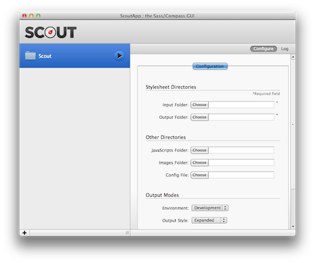
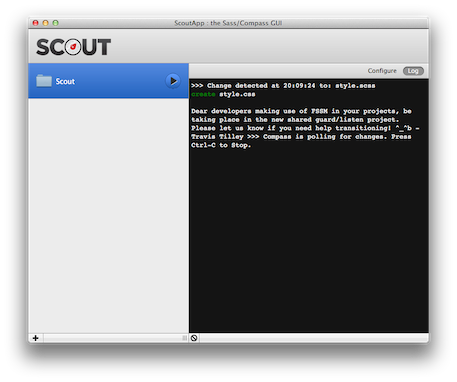

# Setting up for Rapid Prototyping

In this chapter we'll briefly introduce CSS preprocessors (Compass, Sass, LESS, etc.), the Twitter Bootstrap framework, and end with a look at a full-blown workflow tool called Yeoman:
* What is a CSS preprocessor and why should I use one?
* What are Compass and Sass?
* What exactly is Twitter Bootstrap and how can I benefit from it?
* What is Yeoman, and how can it help my rapid prototyping workflow?

## An Overview of the Tools

Let's discuss some of the core tools we'll be using throughout the remainder of this book...

### What is a CSS preprocessor?

A CSS preprocessor is simply a tool that takes text you've written in the preprocessor's language (usually a super-set of CSS), and converts it in to valid CSS. Because the preprocessor language is, essentially a super-set of CSS, it adds useful mechanisms such as variables, nesting, mixins, basic math, etc.

Just taking the variable mechanism as an example, you might define a color variable in one place and then reference it later as needed:

```css
$dark: #333;
...
.foo { background-color: $dark }
.bar { background-color: $dark }
.baz { background-color: $dark }
```

Later, if you decide you'd like $dark to be, well, a bit darker, you could simply redefine the initial declaration like so:

```css
$dark: #191919;
```

Now, `.foo`, `.bar`, and `.baz` will all be updated to use the new background-color the next time your .scss file is converted to CSS.

I'd be remiss not to mention that the three most popular CSS preprocessors today are LESS, Sass, and Stylus. All have their merits, but rather than digress, we'll save space and assume you prefer Sass.

### Why use a CSS preprocessor?

If you've done much web development, you're already aware that CSS can get unruly fast! Using a preprocessor affords a nice means of keeping CSS organized and maintainable. This point is best proven by example—so let's move on to discussing Sass.

### What is Sass?

Sass is an open source tool that allows its metalanguage—also called Sass—to be interpreted into CSS. It has two syntaxes, `.sass` and `.scss`. We'll only be covering the `.scss` syntax which is a super set of CSS that provides conveniences such as: variables, nesting, mixins, selector inheritance, and much more. [[1]][sass-wikip] In a bit, we'll examine exactly what those mechanisms are and how they work. But for now, let's take a look at Sass's complimentary technology Compass. [[2]][sassbook]

### What is Compass?

Compass is a combination of things. It's a workflow tool for Sass that sets up relative paths (such as the relative path to your images via the image_url property; it does this via a config.rb configuration file). It then "watches" changes you make in your .scss files compiling those in to valid CSS. Compass also provides is a vast library of reusable Sass mixins for grids, tables, lists, CSS3, and more. Lastly, Compass is a full scope platform for building frameworks and extensions. [[3]][eppstein-compass]

Again, we'll be going over how to use Compass in more detail soon, but first let's have a quick look at Twitter Bootstrap...

### Twitter Bootstrap: Not just a CSS framework!

Twitter Bootstrap is an open source framework that contains a set of CSS boiler plate templates for typography, buttons, charts, forms, tables, navigation and layout, etc. This CSS depends on a small set of HTML class name conventions such that any web author can "hook into" these styles by simply providing the proper markup. It also features a 12-column responsive grid so your site can adapt to different devices. It's currently the most popular GitHub project and used by big hitters such as NASA and MSNBC. [[4]][bootstrap-big-hitters]

In addition to interface components, the Bootstrap framework provides a plethora of JavaScript plugins that support dynamic UI components such as Modal, Tab, Tooltip, Popover, Alert, Carousel, Typeahead, Dropdown, and more. It's only real dependency is jQuery. We will focus more on customizing web sites with Sass with Bootstrap and less on the JavaScript side of Bootstrap.

## Setting Up For Development

In this section we will be setting the stage for things to come by installing Compass/Sass, Twitter Bootstrap and any other dependencies along the way. We'll first show how you to set up some of the tools individually, and then show how you can do it all at once with Yeoman. If you're already sure you want to use Yeoman feel free to skip to that section (but first ensure you have Git and Ruby installed).

In this section we'll cover:

* Installing Compass and Sass?
* Installing Twitter Bootstrap

### Installing Ruby

In order to use Compass and Sass you'll need to first install Ruby. If you're on OS X you already have it. For Linux users I'm going to assume you're adept enough on the command line to get Ruby installed yourself. Windows users can download an executable installer at: http://rubyinstaller.org/downloads/.

### Installing Compass and Sass

With that done, you should be able to open a command line and use the gem command. If you install Compass you get Sass installed for free. You'll need to use the command line terminal.

__Windows__

```bash
$ gem install sass
```

__Linux / OS X__

```bash
$ sudo gem install sass
```

__OS X GUI Installer__

If you're on a Mac, you can optionally use Chris Eppstein's [graphical installer package][osx-sass-installer]

__Sass Only__

If for some reason don't want to install Compass you can install Sass individually as follows:

```bash
$ gem install sass
```

### Installing Twitter Bootstrap

If you already have extensive experience with Bootstrap and just want to get on with using Sass to customize Bootstrap, you may choose to skip (or perhaps skim) this section.

Before combining technologies such as Bootstrap and Sass, it's useful to play with them in isolation to get a better understanding of how they work. In that spirit, let's download a "vanilla version" of Bootstrap (not adapted for Sass) and have some fun.

Don't worry, we'll soon get to using bootstrap-sass in later sections.

There are a couple ways to get Bootstrap. One is simply to go to their site and download the zip:

* Go to http://twitter.github.com/bootstrap/
* Click the huge Download Bootstrap button
* Extract the downloaded file and ensure you see the css img and js directories
* Go to the Twitter Bootstrap Examples page
* Right-click any of the examples you'd like to play with and  'Save Link As'
* Save the .html file to the top level of the same directory you extracted Bootstrap too
* Open the .html file in an editor and search for: ../assets/ and replace with empty string (empty string...as in blank!)

This should have found any link or src tags with relative paths like:

```html
<link href="../assets/css/bootstrap-responsive.css" rel="stylesheet">
```

and replaced them with relative paths that look like:

```html
<link href="css/bootstrap-responsive.css" rel="stylesheet">
```

Now double click that file and it should look as it did when you previewed it on their web site. If you're unfamiliar with Twitter Bootstrap, feel free to start hacking away off that static file now, or skip to the exercises section below.

### Alternate Install

If you're more of the command line type you've probably already cloned their repo, but if not try this (you'll need to have and internet connection and Node.js and Git installed):

```bash
$ git clone git://github.com/twitter/bootstrap.git && cd bootstrap && npm install && make && make test
```

That will clone the Bootstrap repository, put you in the cloned directory, install all the node packages that Bootstrap requires, build Bootstrap's LESS files, compile it's documentation, etc., and run the full test suite...whew!

Alternatively, if you happen to have nodejs and Twitter's package manager Bower  installed you might do:

```bash
$ bower install bootstrap .
```

If you've elected to use one of these command line methods to download Bootstrap, you should still go download an example .html file from the Twitter Bootstrap Examples page and ensure you can get it to render properly on your local system by replacing any invalid relative paths. Then do the exercises that follow.

## Exercises

As this is an advanced guide and we'd like to focus more on applying Sass to Twitter Bootstrap (then Bootstrap itself), you should definitely attempt complete the following exercises:

* Have a quick read through of the Twitter Bootstrap documentation which is only a half dozen pages or so. Don't worry about memorizing every last detail; just try to get a general feel for where they cover what, what's available, conventions they use, etc.—you'll be visiting those docs frequently

If you haven't already used Twitter Bootstrap before please do the following:
* Take the skeleton app we created above (in the section on Scout), and add jQuery and Bootstrap (in that order). The goal is to get a simple static page assembled with a form, table, and perhaps a navigation bar

_"What!", you say..."He hasn't went over that yet!" Sure, but this is an advanced guide and we'd like to pack as much Sass related material as possible, so we're counting on you to know or "ramp up" on Bootstrap yourself. Here are some suggestions to make this easier:_

* For guidance on how to refactor our simple index.html page, have a look at the Getting Started page. You'll want to include jQuery and Bootstrap as they do
* Have a look at the Layouts section for guidance on how to control your widths and flow
* See the Base CSS section for guidance on forms and tables
* See the Navbar docs for guidance on the navigation bar


## Workflow Alternatives

This section will discuss some workflow alternatives for designers, and Yeoman for our command line lovers.

### Give me a GUI please!

For those of you that prefer to stay away from the command line you have some GUI alternatives.

#### Scout

Scout is a simple GUI that sits on top of Adobe Air. Head on over to http://mhs.github.io/scout-app/ where you can download and installer for either OS X or Windows. Simply download and follow the installer instructions. Open up Scout and click the plus sign on the lower left and navigate to the directory you'd like to create your project in. Once you've selected a directory and clicked 'Open', you're new project will show up in Scout




Here, I've created a folder called 'Scout' (and that's why my project is showing up in the left side of the Scout interface as such). As we can see, we're required to select the input and output folders. However, we haven't set those yet...let's do so.

In the Scout directory, manually create the following directory structure and files:

```bash
|-- css
|-- index.html
|-- sass
    |-- style.scss
```

The index.html file should contain:

```html
<!doctype html>
<head><title>Compass Sass Sandbox</title>
<link href="css/style.css" rel="stylesheet" type="text/css" />
</head>
<body>
    <div class="test">This is a test.</div>
</body>
</html>
```

And the sass/style.scss file should contain:

```css
@import "compass/reset";
$testColor: #008080;
.test {
    color: $testColor;
}
```

It should be self-evident that we're importing Compass's reset, defining a color variable, and using it on the .test class we defined in our markup. Now go back to the Scout application. For the 'Input Folder' click the 'Choose' button and find the sass directory we defined above; do the same for the Output Folder but this time choose the css directory. The idea here is that the input files will get fetched up from the .scss directory, converted to CSS, and output as .css files to the output directory.

Once you've set up the input and output folders, simply click the big "play button" beside your project name to start Scout "watching" for file modifications. The first time I did this it took several seconds before I actually saw the output on the log tab showing that the style.scss file was detected and the style.css file was created:



If for some reason you don't see this try re-saving your style.scss file to force Scout to compile it.

At this point you should be able to double click on the project's index.html file and see This is a test in teal. Not too exciting yet—I know—but we've now seen a simple Compass/Sass workflow using Scout. Try making a few more edits to the .scss file and you'll see that Scout detects them and recompiles a new modified .css file for you. Nice!

While your at it have a quick look at the generated CSS file. Now try removing the Compass reset import line and see what's generated. You should see all of the boiler-plate reset CSS was removed (as expected), and just see the changes made on the .test class.

### Commercial GUI

If you're willing to fork out a small sum of money for slightly "slicker" interfaces, you might want to take a look at CodeKit, Compass.app, or LiveReload.

## Yeoman

If you're a CLI junky looking to fully optimize your front-end set up, you might want to take a look at Yeoman. Yeoman is spearheaded by none other than Paul Irish, Addy Osmani, and Sindre Sorhus. Yeoman bundles LiveReload, Grunt, Bower, Modernizr (and much more) in to one very convenient command line tool. It is still in BETA, so don't use unless you're "adventurous". That said, the author has had success using Yeoman since version 1.0 was released a few months before writing this guide. We'll be using Yeoman to do all our heavy lifting through-out the remainder of this book.

Note that a full discussion of Yeoman is beyond the scope of this book so we'll just be giving you a taste of its powers here. Yeoman is a tool that "stands on the shoulders of giants", and so to be fully effective with it, you'll need to also understand the tools it wraps (e.g. Grunt, Bower, Modernizr, etc.), all of which we'll be discussing as we move to later chapters in the book. This can be done over time, and you can still get workflow benefits early on.

If you have Node.js, Git, Ruby and Compass already installed, you should be able to get Yeoman up and running with the following commands:

```bash
$ mkdir myproject && cd $_ # Note that $_ holds the last argument of previous command
$ npm install -g yo grunt-cli bower # -g installs these globally
$ yo # Read the usage and then do Control-C to exit
$ yo webapp # answer any questions and hit ENTER
$ npm install && bower install
$ grunt server
```

At this point, you'll have a fully prepared web app scaffolded and should be previewing your web app in a web browser. When you ran the yo webapp command, one of the questions you were asked should have looked like:

```bash
Would you like to include Twitter Bootstrap for Sass? (Y/n)
```

Well, isn't that nice! This alone is incredibly relevant to the subject being covered in this book (using Sass with Bootstrap), and Yeoman makes it incredibly convenient to set up Compass/Sass based projects fast...woo-hoo!

We should mention that you can adapt projects like these to your hearts content using Yeoman's primary tools:

* Yo—a tool for customizing projects and generating scaffolding
* Grunt—you can use Grunt to create custom workflows for testing, deployment, coding standards verification, etc. You might think of this tool as an "opinionated replacement" for Ant, Rake, or make, but that uses JavaScript. I say opinionated because it's idioms  target developers familiar with common JavaScript conventions
* Bower—use Bower to install and/or updated your front-end packages. Bower is to front-end development what npm is to Node.js (ok, that's a bit of a stretch cause there are many nice alternatives...but you get the point!)

Did you notice the webapp part back when we initiated our Yeoman project? In Yeoman parlance, that's called a generator. The webapp generator is installed by default, but others require you to install them yourself via npm (that stands for node package manager which is bundled with Node.js).

New generators are being added all the time, but today the Yeoman team officially supports the following ones:

* Web App (comes by default)
* AngularJS
* Backbone
* BBB (Backbone Boilerplate)
* Chrome Apps Basic Boilerplate
* Ember
* Jasmine
* Mocha
* Karma

All generators besides the built in webapp generator need to be installed separately:

```bash
$ npm install -g generator-bbb # -g installs the bbb generator globally
$ mkdir myproject && cd $_ && yo bbb
$ grunt && grunt test && grunt server
```

That would install the backbone boiler-plate generator, create a project, and then build, test, and preview it.

The above example workflows are just a couple ways you might use Yeoman to scaffold out a web app. Visit the Yeoman site (or the author's youtube How to code channel which has several tutorials on using Yeoman) to get more information on this lovely tool.

## Summary

In this chapter we've:

* Discovered CSS preprocessors
* Discovered and installed Compass and Sass
* Discovered and installed Twitter Bootstrap
* Saw some Compass and Sass GUI alternatives
* Played a bit with Yeoman

It's now time to delve in to the syntax of Compass and Sass. Let's go get our hands dirty, shall we!
