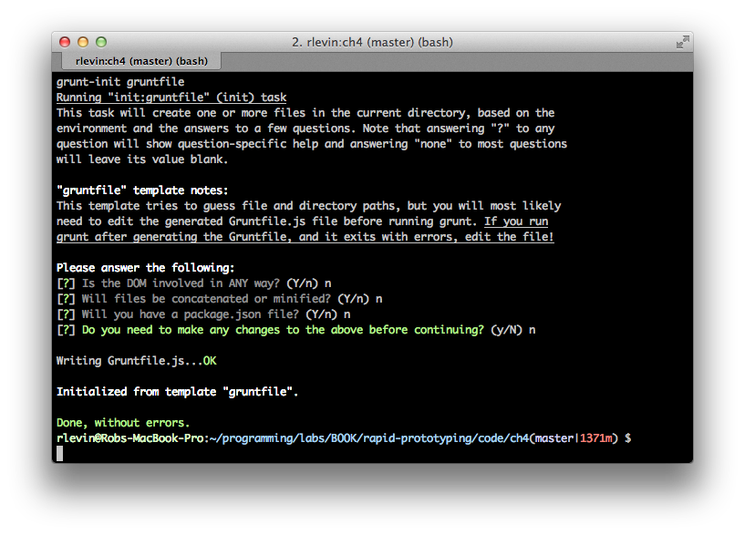
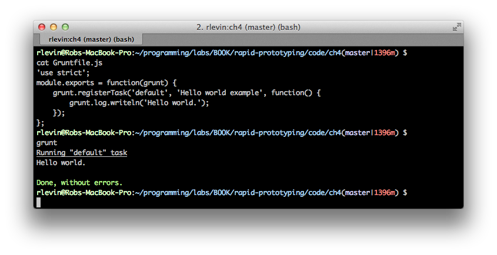
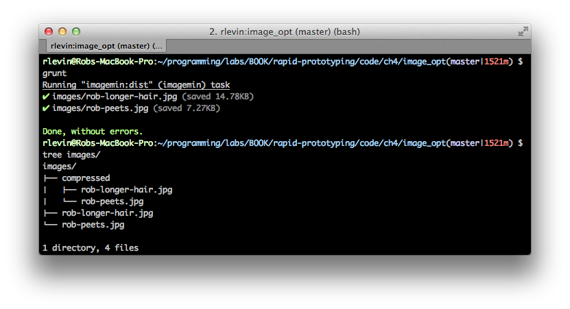

<a id="yeoman"></a>

# Yeoman

In this chapter we'll be having a look at the workhorse workflow tool [Yeoman][yeoman]. Yeoman's core consists of three tools: [Yo][yo], [Grunt][grunt], and [Bower][bower]. We will go over each in depth. If you haven't read the section on Yeoman in the [Setting Up](#setting_up) chapter, go read that and ensure you're properly set up to use Yeoman.

## What is Yeoman?

At its heart, Yeoman is a workflow power-tool that provides a suite of popular front-end tools to facilitate developing with best practices and efficient workflow. It's pioneers, [Addy Osmani][addy] and [Paul Irish][paulirish], are deeply commited to making the modern web development process better and faster. While there are a ton of tools available in the Yeoman eco-system, its imperative to learn its core tools first. Let's dig in.

## Yo

The first core tool we'll look at is Yo, Yeoman's scaffolding tool that helps you to efficiently bootstrap projects. It not only scaffolds out your app, but also gives you sensible default configuration files that get you up and running quickly.

With Yo, there are three main things to learn:

* How to use Yo to bootstrap a project
* How to install custom generators
* How to create your own custom generators

We'll put off learning how to build a custom generator for a later chapter and now have a look at common `Yo` use.

### Yeoman's Default Generator

As you should have seen in the Yeoman section of the [Setting Up](#setting_up) chapter, by default Yeoman already ships with the `webapp` generator. This default generator is immediately useful with its sensible scaffold choices of [HTML5 Boilerplate][html5b], [jQuery][jquery], [Modernizr][modernizr], and optionally, [Twitter Bootstrap][bootstrap]. If you choose to use [Bootstrap][bootstrap], you can also optionally select to use the [Sass][sass] preprocessor. You can probably get along fine for many front-end projects just using this single generator (especially since Bower, Yeoman's package manager, allows you to simply add libraries on an as needed basis. _We'll learn about that tool in just a bit_). Magically, Yeoman creates _grunt tasks_ for your project when you use this tool so you'll benefit from an sensible initial set up.

The main command to get started with the `webapp` generator is simply:

```bash
yo webapp
```

Answer the few questions and your off and running. Let's take a look at installing other generators next.

### Installing Generators

Perhaps you'd like to use the venerable [Backbone Boilerplate][bbb] via Yeoman. To do so you would first need to install the generator:

```bash
npm install -g generator-bbb
```

_This assumes you've installed node.js (which bundles `npm`). If not, again, go to the [section on setting up Yeoman](#yeoman_setup) before proceeding)_

Next you would simply create a project directory and issue the `yo bbb` command as follows:

```bash
mkdir project && cd $_ && yo bbb
```

As usual, you can build and preview your Yeoman project using grunt as follows:

```bash
grunt server
```

As you may have noticed, we've installed the `generator-bbb`, but used `bbb` when issuing the `yo` command. This seems to be an undocumented idiom as `generator-angular` would be triggered with `yo angular`, etc.

## Grunt

The next core tool we'll have a look at is Yeoman's build tool extraordinaire [Grunt][grunt] authored by "Cowboy" [Ben Alman][benalman]. Grunt allows you to efficiently build and deploy your application, run tests, and preview your changes instantaneously. It's used by Twitter, jQuery, and [many other high-profile projects][gruntusers]. Grunt has a mountain of features and plugins available and we'll only be covering some of them here; of course you can always reference their [docs][gruntdocs] once you're comfortable with the basics.

_Note that Grunt's sweet-spot is task-based configuration management (much like Ant or Make but in JavaScript/Node.js), where you're files are built as appropriately for production, testing, development environments, etc. As such, much of the documentation and tutorials you'll find on Grunt will already address these sorts of tasks. In order to get a more general understanding of Grunt, we'll be using much simpler if not slightly pedantic examples. Using this basic knowledge as a point of departure, you should then be able to utilize Grunt for more practical purposes._

The basics of how Grunt's command line system works are as follows:

* you run the Grunt CLI in a project directory that contains a `Gruntfile.js`
* the Grunt CLI runner loads the grunt library
* using the configurations found in that `Gruntfile.js` it then executes the task(s) as you've requested

_If you're project has not yet loaded its dependencies, you'll need to do so with_:

```bash
npm install
```

### package.json

The `package.json` file is just a simple JSON file that declaratively specifies which dependencies should be included in your Grunt based project. See Grunt's documentation on the [package.json][gruntpackage] for more information and an example on how this works. Luckily, when using Yeoman, we get a nice default `package.json` which can serve as a starting point for further customization.

Besides hand editing the `package.json` file itself, you can choose to install new packages with the following general syntax:

```bash
npm install PACKAGE --save-dev
```

(where `PACKAGE` is the desired `npm` package you'd like installed). This will both install the package and add it to your `package.json` configuration file.

### Gruntfile

The `Gruntfile.js` is simply a JavaScript file that contains your project's configuration and tasks. (CoffeeScript may be used instead of JavaScript but we won't be covering that here). It should be placed at the root directory of your project (as with the `package.json` file discussed earlier).

Taking a very high-level look at the contents of a typical `Gruntfile.js` we will find the following:

* An outer "wrapper" function

```javascript
module.exports = function(grunt) {
    // ...
};
```

* An initial configuration section:

```javascript
  grunt.initConfig({
    // ...
  });
```

If you're familiar with JavaScript (and you better be for this book), you'll notice that `initConfig` is passed an _object literal_. That object literal represents a "configuration object" that will thereafter be available throughout the `Gruntfile.js` as `grunt.config`. The general purpose of this section is to set up any global initialization or bootstrapping required by your Grunt tasks.

* Default task

```javascript
    grunt.registerTask('default', ['task1', 'task2']);
```

The `registerTask` method is a general purpose means for registering Grunt tasks. It just so happens that here we've specified 'default' task which will be run by Grunt when we issue `grunt` without specifying any additional arguments.

Another example of using `registerTask`, can be seen from the boiler-plate generated by Yeoman when you run `yo webapp`. If you look at that generated `Gruntfile.js` it will contain something like:

```javascript
    grunt.registerTask('test', [
        'clean:server',
        'concurrent:test',
        'connect:test',
        'mocha'
    ]);
```

In this case, the task name is called `test`, and will, in turn, run a set of test related tasks.

We'll learn more about the power of registering tasks later, but this should suffice for having an initial understanding of what's going on. You may want to take a quick break and try the following from an arbitrary directory of your choosing:

```bash
mkdir tmp && cd $_ && yo webapp
cat Gruntfile.js # or just open in an editor
```

Using your editor or "grep-fu", find all the places in that file that use `grunt.registerTask`. It should be contextually evident what going on. Congratulations! You've now got a bit more of an idea what task Yeoman is helping you with out of the box.

### Grunt Init

Let's now perform the obligatory _Hello World_ using Grunt.

As Grunt 0.4 onwards has completely modularized the Grunt system, each component is installed independently. Let's grab some convenient packages for Gruntfile authoring:

```bash
git clone https://github.com/gruntjs/grunt-init-gruntfile.git ~/.grunt-init/gruntfile
npm install -g grunt-init
mkdir myproject && cd $_
grunt-init gruntfile
```

For this exercise go ahead and answer No for all of Grunt init's questions. This should place a boiler-plate `Gruntfile.js` file in your `myproject` directory.



As you can see, we've used `grunt-init gruntfile` to scaffold out an initial `Gruntfile.js`. Let's remove everything in the file for this exercise except for the following "wrapper" function:

```javascript
'use strict';
module.exports = function(grunt) {
};
```

Now create a package.json with the following:

```json
{
  "name": "myproject",
  "version": "0.0.1"
}
```

This is the bare minimum you'll need to supply for your `package.json`. Let's go ahead and ensure we have grunt installed for the project as a development dependency:

```bash
npm install grunt --save-dev
```

Our `package.json` file should now contain an entry for Grunt itself:

```json
{
  "name": "myproject",
  "version": "0.0.1",
  "devDependencies": {
    "grunt": "~0.4.1"
  }
}
```

Go ahead and run grunt:

```bash
$ grunt
Warning: Task "default" not found. Use --force to continue.

Aborted due to warnings.
```

This makes sense, we haven't created any tasks, and issuing `grunt` with no arguments causes Grunt to look for a "default task". Let's create one now.

```javascript
'use strict';
module.exports = function(grunt) {
    grunt.registerTask('default', 'Hello world example', function() {
        grunt.log.writeln('Hello world.');
    });
};
```

This should be painfully self-evident, but we've went ahead and registered the needed required task, and provided a callback function that simply prints our Hello World. Now try issuing `grunt` again:



_I'm a bit of an odd duck so don't be thrown off...I like to run my commands on the line following my PS1 prompt so I have a bit more room._

So, just to be clear that you understand the venerable default task, rename the task from `default` to `foo`, and re-run `grunt`. You should get the same error we had before since we no longer have a default task. But this time, issue `grunt foo` which will ask grunt to run the `foo` task.


### Image Optimization

Let's go ahead and create a slightly more useful task that optimizes images by leveraging the [grunt-contrib-imagemin plugin][imagemin] Grunt plugin. The plugin, in turn, uses [OptiPNG][optipng] to optimize `.png` images, and [jpegtran][jpegtran] to optimize `jpg` images. We'll be using `jpg` images here, but the process is essentially the same for `png` images.

First use the same process we used in the Hello World example above to `grunt-init` a Grunt project. Then install the `imagemin` plugin:

```bash
npm install grunt-contrib-imagemin --save-dev
```

Ensure that your `package.json` looks something like:

```javascript
{
  "name": "image_opt",
  "version": "0.0.1",
  "devDependencies": {
    "grunt": "~0.4.1",
    "grunt-contrib-imagemin": "~0.1.4"
  }
}
```

To recap, we have both `grunt` and `grunt-contrib-imagemin` included as development dependencies. There's a chance that your versions will be later than what's listed here as that should pull in the "latest" versions available.

To see this all in action, you'll want to create an `images` directory off your project's root directory, and place some images in there (I tested with `jpg` images, but `png` images should work with this too).

Now put the following in your `Gruntfile.js`:

```javascript
'use strict';
module.exports = function(grunt) {
  grunt.initConfig({
    imagemin: {
      dist: {
        options: {
          progressive: true,
          // Only for pngs
          optimizationLevel: 7
        },
        files: [{
          // Assumes running from project root
          expand: true,
          cwd: './images',
          src: '*.{png,jpg,jpeg}',
          dest: './images/compressed',
        }]
      }
    }
  });
  // Include the imagemin npm
  grunt.loadNpmTasks('grunt-contrib-imagemin');
  // Register imagemin task as default task
  grunt.registerTask('default', ['imagemin:dist']);
};
```

As explained earlier, the `initConfig` is simply an initial set up section that you can define globally accessible properties etc. Here's we've went ahead and put the `imagemin` task in `initConfig`. Nested within that task is a "target" called `dist`. In this example, there's only one target, but we could have included another one like `supercrunch` with higher compression levels, etc.

The `loadNpmTasks` loads the imagemin Grunt plugin, and finally, `registerTask` registers our `imagemin:dist` (the colon syntax stands for `task:target`) as the default task. As you should expect, we can run this default task by simply issuing `grunt` as follows:



As you can see, our compressed images have been created in the `images/compressed` directory, and we've shaved a bit of file size off our images.

_Note that the imagemin plugin was a bit buggy initially but it seems to have become stable (at least in our experiments). If you for some reason can't get this running on your platform, be sure to visit the project's [issue tracker][imagemin_issues]. Please be sympathetic to the maintainer, since getting image optimization tools to work across platforms is quite a challenge!_

It turns out that our little exercise here is included for us when using Yeoman. For example, after scaffolding a Yeoman project, check the `Gruntfile.js` (or `Gruntfile.coffee` if applicable) for the `img` task which will optimize .png or .jpg images using [OptiPNG][optipng] and [JPEGtran][jpegtran] similar to how we've just done here.

### Going Further

While you now have a nice grounding in Grunt, we've only scratched the surface. Please have a look at the [Grunt Documentation][gruntdocs] for further mastery.

## Bower

Yeoman's front-end package manager, Bower, helps you to manage your application's dependencies via a small set of command lines that make installing and updating libraries a breeze. While you've probably used another package manager tool that's somewhat similar to Bower, there's a particular philosophy that makes Bower unique. From their docs:

> There are no system wide dependencies, no dependencies are shared between different apps, and the dependency tree is flat.

> Bower runs over Git, and is package-agnostic. A packaged component can be made up of any type of asset, and use any type of transport (e.g., AMD, CommonJS, etc.).

In order to get up to speed quickly, you can always ask for help:

```bash
bower help
```

### Finding and installing packages

The most common use case you'll have for Bower is to find and install a package which can be done as follows:

```bash
bower search jquery
```

This will produce a ton of output since there are many packages that have the string jquery in them. You might want to use something like the following to narrow your search, for example, if you were searching for the jQuery timeago package:

```bash
bower search jquery | grep time
    jquery-timeago git://github.com/rmm5t/jquery-timeago.git
    ... more output omitted

# To get information on timeago:
bower info jquery-timeago
jquery-timeago

  Versions:
    - v1.2.0
    - v1.1.0
    ... more output omitted

# Now install it with:
bower install jquery-timeago
```

You can, alternatively, use tags:
```bash
bower install <package>#<version>
```

Intuitively, if you need to later update or uninstall the package you can simply do:

```bash
bower update jquery-timeago
# or to remove
bower uninstall jquery-timeago
```


You can also configure your settings by editing the `.bowerrc` file in your project's root. This is a simple JSON file that specifies what `directory` to store your components, etc. For more information, see the [Bower configuration][bowerconfig] documentation.

While this is most of what you'll be doing day to day with Bower, it does also offer you the ability to create your own pacakges and interact with a programmatic API. These topics are out of scope for this book so the [Bower site][bower] is your best bet should you need to delve deeper.

## Custom generators

http://yeoman.io/generators.html
http://benclinkinbeard.com/blog/2013/04/a-quick-and-dirty-introduction-to-yeoman-generator-development/


