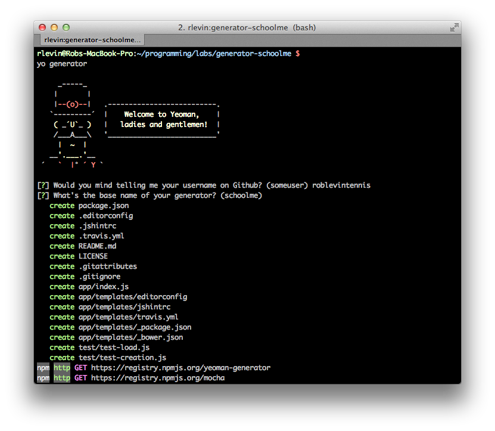
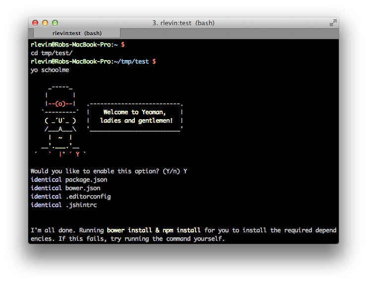
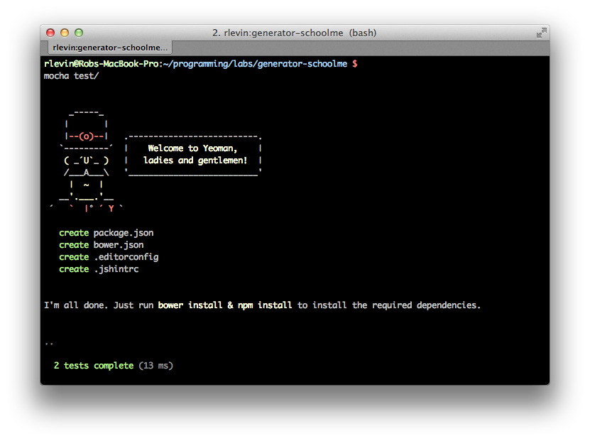
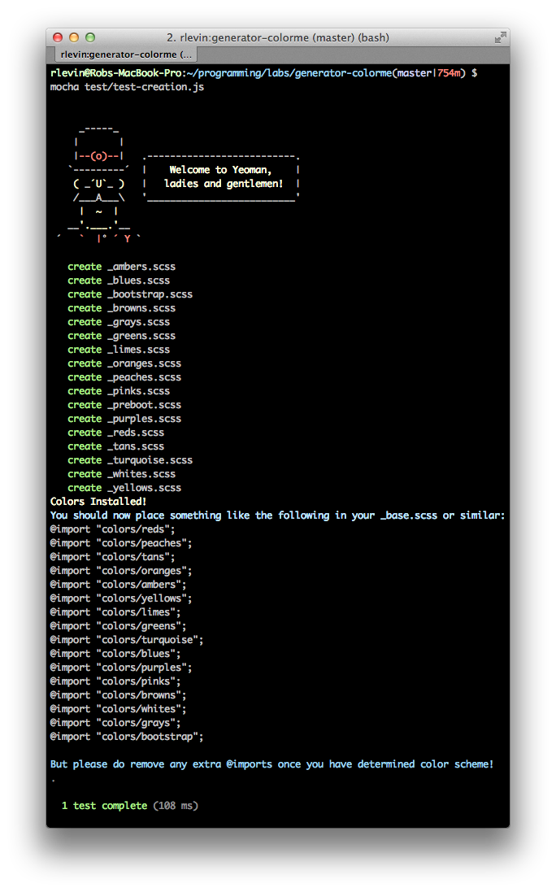

<a id="yeoman_custom_generator"></a>

# Yeoman Custom Generators

The material in towards the end of this chapter my be considered a bit advanced in that it will assume the reader either has had some experience using [Node.js][node], or is resourceful enough to learn it on their own. Yeoman generators leverage [Node.js][node], and so there are a combination of API's one can use to create a custom generator:

* [Yeoman's Generator API][generatordocs]
* [Node.js API][nodeapi]

The convention is to first look for a way to achieve your task using the Yeoman generator methods provided, but then utilize Node.js if/when needed. In this example, we'll be using a bit of both. You'll likely want to also have the [Yeoman generator documentation][generatordocs] open at the same time as reading this chapter.

You'll first need to install the `generator-generator` and then run that to create your generator project:

```bash
npm install -g yo generator-generator
mkdir schoolme && cd $_
yo generator
```



Answer it's questions and then ensure that you can play with your generator in progress globally by issuing:

```bash
npm link
```

For me, this linked the files like:

```
/usr/local/lib/node_modules/generator-schoolme -> /Users/rlevin/programming/labs/generator-schoolme
```



For kicks, let run the pre-installed Mocha tests:

```
mocha test
```



Ok, we should be good to get started...

## Yeoman's "chain of execution"

Take a look at the generator-schoolme/app/index.js which is our generator's main entry point. Yeoman's convention is to call the methods defined in this file from top to bottom.

* Constructor

```javascript
var SchoolmeGenerator = module.exports = function SchoolmeGenerator(args, options, config) {
```

gets called first (but keep a mental note of the `this.on('end')` line as that registers for the asynchronous `end` callback).

* `SchoolmeGenerator.prototype` methods will be called next
* `this.end` defined in constructor will be called last


```javascript
'use strict';
var util = require('util');
var path = require('path');
var yeoman = require('yeoman-generator');

var SchoolmeGenerator = module.exports = function SchoolmeGenerator(args, options, config) {
  // https://github.com/yeoman/generator/blob/master/lib/base.js
  yeoman.generators.Base.apply(this, arguments);

  this.on('end', function () {
    this.installDependencies({ skipInstall: options['skip-install'] });
  });

  this.pkg = JSON.parse(this.readFileAsString(path.join(__dirname, '../package.json')));
};

util.inherits(SchoolmeGenerator, yeoman.generators.Base);

SchoolmeGenerator.prototype.askFor = function askFor() {
  var cb = this.async();

  // welcome message
  var welcome =
  //... code purposely omitted

  console.log(welcome);

  var prompts = [{
    name: 'fooOption',
    message: 'Would you like to do some Foo?',
    default: 'Y/n',
    warning: 'Yes: This will do foo action.'
  }];

  this.prompt(prompts, function (err, props) {
    if (err) {
      return this.emit('error', err);
    }
    this.fooOption = (/y/i).test(props.fooOption);
    cb();
  }.bind(this));
};

SchoolmeGenerator.prototype.foo = function app() {
  console.log("FOO got called");
};

SchoolmeGenerator.prototype.bar = function projectfiles() {
  console.log("Bar got called");
};

```

Let's run this. I advise that you have another console tab open so we don't later inadvertantly copy files in to our generator's project directory. You did the `npm link` step earlier so you should be able to run this from anywhere. So after opening a new console tab do:

```bash
cd /tmp && yo schoolme
```

After answering the promt you should see our foo and bar logs get printed as expected.

## Another Simple Generator

Ok, so now that you're getting the hang of a simple generator, let's do one more, still fairly simple generator to simply port a small library of interest. Conveniently, many of the more popular projects are getting ported over to Yeoman generators daily. For example, don't wanna use Twitter Bootstrap, you'll find Zurb Foundation, etc. And it's only getting better with time. However, you may like some obscure or new library that you'd like to include in your workflow. Well, it's really not that hard! For our second, somehwat more useful generator, I've decided I'd like to port over a sweet little color library for Sass called [color-me-sass][colormesite].

I went through the same general process of using the Yeoman `generator-generator`, and stripped the `app/index.js` to the following (inspired by the already existing `generator-pure`):

```javascript
'use strict';
var util = require('util');
var path = require('path');
var yeoman = require('yeoman-generator');

/**
 * Port of https://github.com/RichardBray/color-me-sass
 */
var ColormeGenerator = module.exports = function ColormeGenerator(args, options, config) {
  yeoman.generators.Base.apply(this, arguments);

  this.on('end', function () {
    // this.installDependencies({ skipInstall: options['skip-install'] });
    var guide = 'Colors Installed! '.yellow.bold +
    '\nYou should now place something like the following in your _base.scss or similar:'.blue.bold +
    '\n@import "colors/reds";' +
    '\n@import "colors/peaches";' +
    '\n@import "colors/tans";' +
    '\n@import "colors/oranges";' +
    '\n@import "colors/ambers";' +
    '\n@import "colors/yellows";' +
    '\n@import "colors/limes";' +
    '\n@import "colors/greens";' +
    '\n@import "colors/turquoise";' +
    '\n@import "colors/blues";' +
    '\n@import "colors/purples";' +
    '\n@import "colors/pinks";' +
    '\n@import "colors/browns";' +
    '\n@import "colors/whites";' +
    '\n@import "colors/grays";' +
    '\n@import "colors/bootstrap";\n';
    console.log(guide);
  });
};

util.inherits(ColormeGenerator, yeoman.generators.Base);

ColormeGenerator.prototype.askFor = function askFor() {
  var cb = this.async();

  // welcome message
  var welcome =
  //... code purposely omitted

  console.log(welcome);

  var prompts = [{
    name: 'destPath',
    message: 'Where would you like me to put the color-me-sass files?',
    default: 'css/colors',
  }];

  this.prompt(prompts, function (err, props) {
    if (err) {
      return this.emit('error', err);
    }
    this.directory('colors', props.destPath);
    cb();
  }.bind(this));
};
```

### Code Walkthrough

Let's take a quick look at how this code works. First we `require` some Node.js modules (well, Yeoman's `generator-generator` did that for us!), and then that "Yeoman generator chain of execution" we talked about earlier kicks in:

* Our constructor gets ran and registers the all important `this.on('end'` _callback_. Even though our constructor runs early in this chain of execution, the `end` callback will fire only at the end once the other `prototype` methods have completed.

* `ColormeGenerator.prototype.askFor` than is ran. That's the section of code that deals with prompts. We only care where the user wants to place the color-me-sass files over to so we prompt accordingly.

* The magical `this.prompt` callback will fire once the user answers.
* Provided there are no errors, we then copy the files over to the `destPath` (where the user said they want the files to be placed):

```javascript
    this.directory('colors', props.destPath);
    cb();
```

After the files were copied over we called the `cb()` that was assigned earlier in that `askFor` method. This is the idiom provided for dealing with asynchronous callbacks if we need them within our generator's methods.

* Finally that `this.on('end'` callback we registered earlier the constructor fires and we simply provide a confirmation message and some usage advise. Notice those pretty standard output colors are available for us to use? Nice!

_In a more comprehensive generator that creates a substantial scaffolding in the `app` directory, we'd would have copied over Bower and NPM template configuration files and `installDependencies` would then be used to install these (I've left this in commented out)._


As you can see this is still a very simple generator, but it serves as a nice example of how easy it is to port a libray you'd like to include in your workflow.

## Generator Tests

It's quite convenient to find that the `generator-generator` already creates a very nice template for creating tests specifically for generators. Since this is a fairly simple generator, I simply verified that the expected files were getting copied over in `test/test-creation.js`

```javascript
/*global describe, beforeEach, it*/
'use strict';

var path    = require('path');
var helpers = require('yeoman-generator').test;

describe('colorme generator', function () {
  beforeEach(function (done) {
    helpers.testDirectory(path.join(__dirname, 'temp'), function (err) {
      if (err) {
        return done(err);
      }
      this.app = helpers.createGenerator('colorme:app', [
        '../../app'
      ]);
      done();
    }.bind(this));
  });
  // Remove all the _*.scss color files copied over
  afterEach(function (done) {
    // Merely using testDirectory results in removal of files:
    // https://github.com/yeoman/generator/blob/master/lib/test/helpers.js
    helpers.testDirectory(path.join(__dirname, 'temp'), function (err) {
      if (err) {
        return done(err);
      }
      done();
    }.bind(this));
  });

  it('generates expected files', function (cb) {
    var expected = ['_blues.scss', '_reds.scss'];
    helpers.mockPrompt(this.app, { destPath: '.' });
    this.app.options['skip-install'] = true;
    this.app.run({}, function () {
      helpers.assertFiles(expected);
      cb();
    });
  });

});
```

We can run this spec with:

```bash
mocha test/test-creation.js
```



TBD - Need to go a bit deeper on how the test above work and possibly provide some links for those that need more information on javascript testing.

## A More Interesting Yeoman Generator

TBD - I have something in mind but waiting to hear back from library author that I'm planning to refactor :)


## Publishing Generators

TBD


